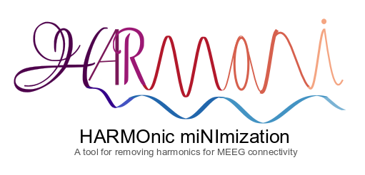

# HARMomic miNImization (Harmoni)
A tool for removing harmonic for MEEG connectivity


<p align="center">
  
</p>

HARMONI
==========

HARMONI is an open-source Python package for eliminating/suppressing the spurious phase synchronization due to the non-sinusoidal shape of the neuronal oscillations. It can be used in connectivity pipelines for investigating within- and cross-frequency phase synchronization with electrophysiological data.

### Citation

Harmoni: a Novel Method for Eliminating Spurious Neuronal Interactions due to the Harmonic Components in Neuronal Data
Mina Jamshidi Idaji, Juanli Zhang, Tilman Stephani, Guido Nolte, Klaus-Robert Mueller, Arno Villringer, Vadim V. Nikulin
https://doi.org/10.1101/2021.10.06.463319


## Installing


In order to install the latest version of HARMONI:


```bash
$ pip install -U harmoni
```

### Dependencies

HARMONI is only dependent on Numpy and Scipy:

- Python >= 3.6
- NumPy >= 1.10
- SciPy >= 0.1

## Licensing


HARMONI is **BSD-licenced** (3 clause):


	Copyright (c) 2021, Mina Jamshidi Idaji
	All rights reserved.

	Redistribution and use in source and binary forms, with or without
	modification, are permitted provided that the following conditions are met:

	1. Redistributions of source code must retain the above copyright notice, this
	   list of conditions and the following disclaimer.

	2. Redistributions in binary form must reproduce the above copyright notice,
	   this list of conditions and the following disclaimer in the documentation
	   and/or other materials provided with the distribution.

	3. Neither the name of the copyright holder nor the names of its
	   contributors may be used to endorse or promote products derived from
	   this software without specific prior written permission.

	THIS SOFTWARE IS PROVIDED BY THE COPYRIGHT HOLDERS AND CONTRIBUTORS "AS IS"
	AND ANY EXPRESS OR IMPLIED WARRANTIES, INCLUDING, BUT NOT LIMITED TO, THE
	IMPLIED WARRANTIES OF MERCHANTABILITY AND FITNESS FOR A PARTICULAR PURPOSE ARE
	DISCLAIMED. IN NO EVENT SHALL THE COPYRIGHT HOLDER OR CONTRIBUTORS BE LIABLE
	FOR ANY DIRECT, INDIRECT, INCIDENTAL, SPECIAL, EXEMPLARY, OR CONSEQUENTIAL
	DAMAGES (INCLUDING, BUT NOT LIMITED TO, PROCUREMENT OF SUBSTITUTE GOODS OR
	SERVICES; LOSS OF USE, DATA, OR PROFITS; OR BUSINESS INTERRUPTION) HOWEVER
	CAUSED AND ON ANY THEORY OF LIABILITY, WHETHER IN CONTRACT, STRICT LIABILITY,
	OR TORT (INCLUDING NEGLIGENCE OR OTHERWISE) ARISING IN ANY WAY OUT OF THE USE
	OF THIS SOFTWARE, EVEN IF ADVISED OF THE POSSIBILITY OF SUCH DAMAGE.


